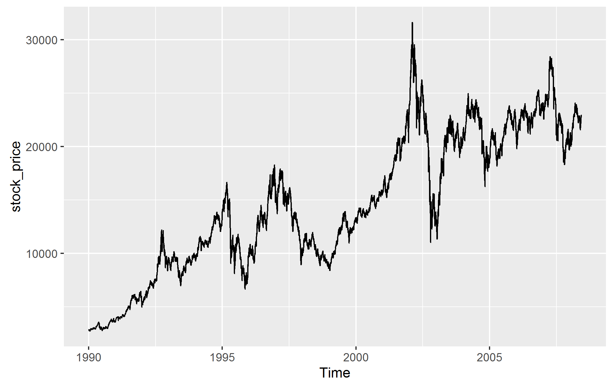

## YahooFinanceData - Creating a custom yahoo finance data

This handy R script is created to extract Financial data from Yahoo Finance available on 
<http://ichart.finance.yahoo.com/table.csv?> for rapid machine learning.


### Data Collection

Yahoo Finance provides a URL-based API for financial stock data extraction, in which you can dynamically build a URL with parameters to specify the stock and the date ranges.

```r
#set start date for historical look
start_year = "1990"
start_month = "1"
start_day = "1"

#get present date
today = Sys.Date()
today_year = format(today, "%Y") # with month as a word
today_month = format(today, "%m") #months are one less for yahoo
today_day = format(today, "%d")

#Yahoo Finance Symbol
tickers = c("^HSI")

stock <- read.csv(paste0("http://ichart.finance.yahoo.com/table.csv?s=",tickers,"&d=",toString(as.double(today_month)-1),"&e=",today_day,"&f=",today_year,"&g=d","&a=",toString(as.double(start_month)-1),"&b=",start_day,"&c=",start_year,"&ignore=.csv", collapse = ", "))
write.csv(stock, file=paste("./DataOut/", tickers,".csv", sep=""))
```


### Data Visualization
Plot Stock

```r
#sort Date
stock_date <- stock[rev(order(as.Date(stock$Date, format="%d/%m/%Y"))),]

#install.packages("dse")
library(dse)
freq=365.25
stock_price<-ts(stock_date$Adj.Close,start=c(1990,1,1),frequency=freq)


#Pretty Chart
library(ggplot2)
library(forecast)
stock_price2<-autoplot(stock_price, s.window="periodic", robust=TRUE)
#autoplot(stl(lflat_net_price, s.window="periodic", robust=TRUE))
ggsave(filename="./Figure/stock_price2.png",plot=stock_price2)
```



